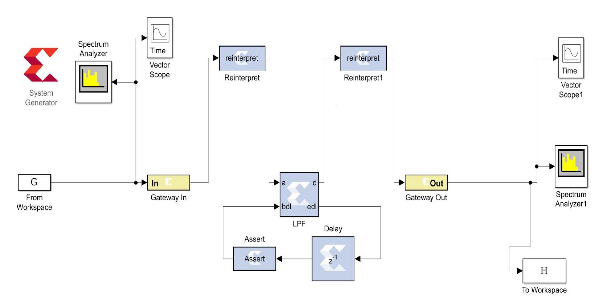
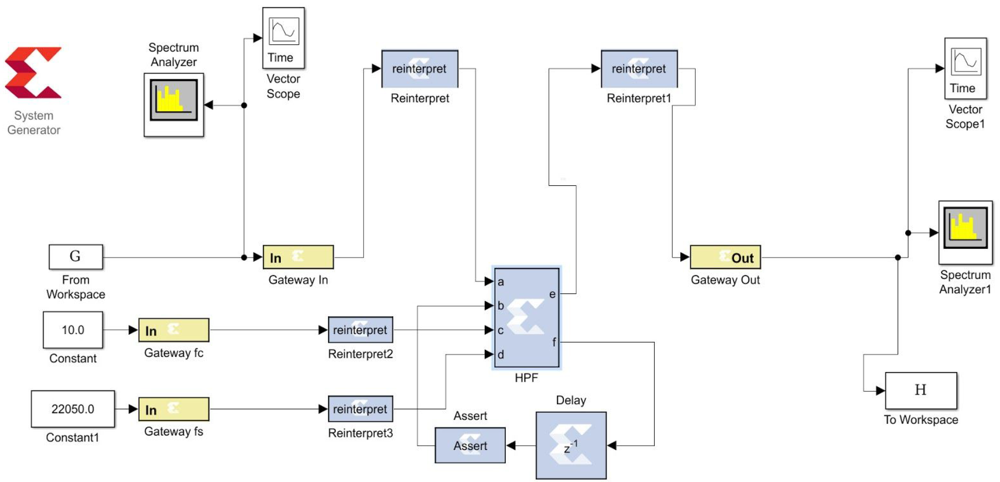

# Filter Implementations
Implementation of Low Pass and High Pass IIR filters.

## Objectives

1. To understand and analyze the design of IIR Low pass filter and High Pass filter.
2. Use Bilinear Transformation scheme to implement the designs of the two filters.
3. Find simulation results of the IIR filters on the FPGA board.

## Designs

#### Low Pass IIR Filter design

#### High Pass IIR Filter design

